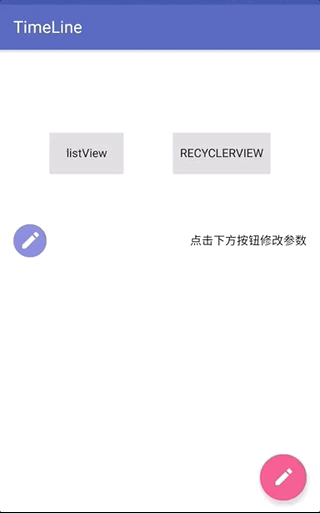

# TimeLine

             
> 提供了仿IOS的越界回弹效果和左右滑动功能，可自由设置最小滑动距离和是否开启滑动功能

示例：[demo.apk](apk/timeline.apk)

#### Download
    implementation 'com.ditclear:swipedraglayout:1.1.0'

#### 截图

					

					


### Feature

- [SwipeDragLayout](https://github.com/vienan/TimeLine/blob/master/swipelayout/src/main/java/com/ditclear/swipelayout/SwipeDragLayout.java)使用ViewDragHelper来进行滑动操作，代码少，易理解，核心代码不过150行
- 使用了保留一个静态类的方法来确保只有一个展开，并在`onDetachedFromWindow`方法中进行关闭操作
- 提供了多种自定义属性，见下表
- [sample](https://github.com/ditclear/SwipeLayout/blob/8d5cfdce76249150b3c37c72cd0a600138fe00d8/app/src/main/java/vienan/app/expandableswipelistview/RecyclerActivity.java)使用了DataBinding和kotlin 进行了多类型的绑定，对于了解和使用DataBinding大有益处，添加多种Type更是十分简单,再也不用extends RecyclerView.Adapter了，可以参考[BindingListAdapter](https://github.com/ditclear/BindingListAdapter)


#### 自定义属性

| attr            |  type   | default |          meaning          |
| --------------- | :-----: | ------: | :-----------------------: |
| need_offset     |  float  |    0.2f |         最小需要滑动的比例         |
| ios             | boolean |    true |         拖动越界回弹效果          |
| swipe_enable    | boolean |    true |           开启滑动            |
| swipe_direction |  enum   |    left | 滑动方向,默认1是左滑left，2为右滑right |

#### 示例

```xml
 <com.ditclear.swipelayout.SwipeDragLayout
                android:id="@+id/swip_layout"
                android:layout_width="match_parent"
                android:layout_height="60dp"
                app:swipe_direction="left"
                app:swipe_enable="true"
                app:ios="true">

            <LinearLayout
                    android:id="@+id/content_layout"
                    android:layout_width="match_parent"
                    android:layout_height="60dp"
                    android:background="#ffffff"
                    android:gravity="center_vertical"
                    android:orientation="horizontal"
                    android:tag="content">

                <ImageView
                        android:id="@+id/iv_type"
                        android:layout_width="40dp"
                        android:layout_height="40dp"
                        android:layout_marginLeft="@dimen/activity_horizontal_margin"
                        android:background="@drawable/type_edit"
                        android:scaleType="centerInside"
                        android:onClick="@{(v)->presenter.onItemClick(v,item)}"
                        android:src="@mipmap/edit"/>

                <TextView
                        android:id="@+id/tv_title"
                        android:layout_width="match_parent"
                        android:layout_height="match_parent"
                        android:ellipsize="end"
                        android:gravity="center_vertical|right"
                        android:maxLines="1"
                        android:paddingRight="@dimen/activity_horizontal_margin"
                        android:onClick="@{(v)->presenter.onItemClick(v,item)}"
                        android:text="@{item.content}"
                        android:textColor="#000000"
                        tools:text="this is content"/>
            </LinearLayout>

            <LinearLayout
                    android:id="@+id/menu_layout"
                    android:layout_width="wrap_content"
                    android:layout_height="wrap_content"
                    android:orientation="horizontal"
                    android:tag="menu">

                <ImageView
                        android:id="@+id/trash"
                        android:layout_width="70dp"
                        android:layout_height="60dp"
                        android:background="#FF6347"
                        android:paddingLeft="25dp"
                        android:onClick="@{(v)->presenter.onItemClick(v,item)}"
                        android:paddingRight="25dp"
                        android:src="@mipmap/trash"/>

                <ImageView
                        android:id="@+id/star"
                        android:layout_width="70dp"
                        android:layout_height="60dp"
                        android:background="#4cd964"
                        android:paddingLeft="22dp"
                        android:paddingRight="22dp"
                        android:onClick="@{(v)->presenter.onItemClick(v,item)}"
                        android:src="@mipmap/star"/>
            </LinearLayout>
        </com.ditclear.swipelayout.SwipeDragLayout>
```

> 注意

暂时只支持两个子View，一个content，一个侧滑的menu，以后会支持

#### 回调监听

```java
    public interface SwipeListener {

        /**
         * 拖动中，可根据offset 进行其他动画
         * @param layout
         * @param offsetRatio  偏移相对于menu宽度的比例
         * @param offset 偏移量px
         */
        void onUpdate(SwipeDragLayout layout, float offsetRatio, float offset);

        /**
         * 展开完成
         * @param layout
         */
        void onOpened(SwipeDragLayout layout);

        /**
         * 关闭完成
         * @param layout
         */
        void onClosed(SwipeDragLayout layout);
    }
```

### License

```txt
Copyright 2018 ditclear

Licensed under the Apache License, Version 2.0 (the "License");
you may not use this file except in compliance with the License.
You may obtain a copy of the License at

  http://www.apache.org/licenses/LICENSE-2.0

Unless required by applicable law or agreed to in writing, software
distributed under the License is distributed on an "AS IS" BASIS,
WITHOUT WARRANTIES OR CONDITIONS OF ANY KIND, either express or implied.
See the License for the specific language governing permissions and
limitations under the License.
```

